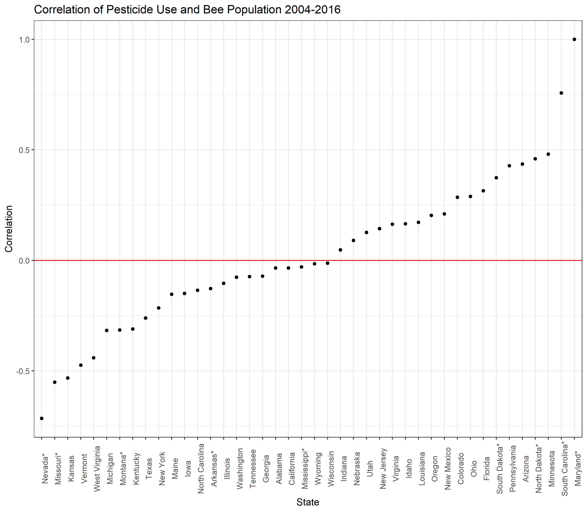
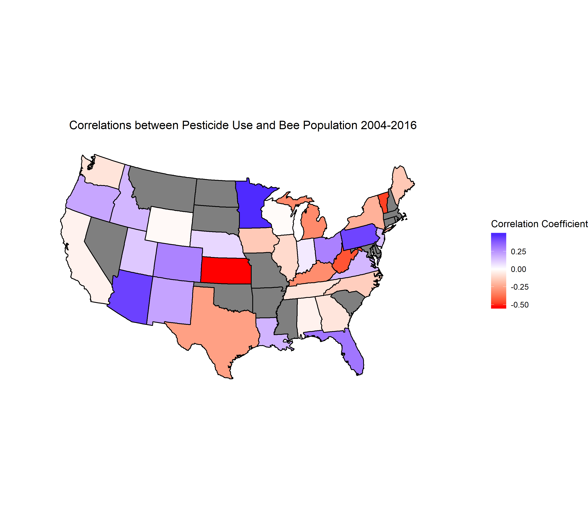
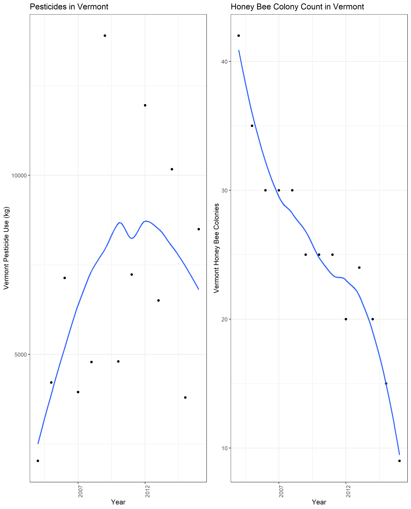
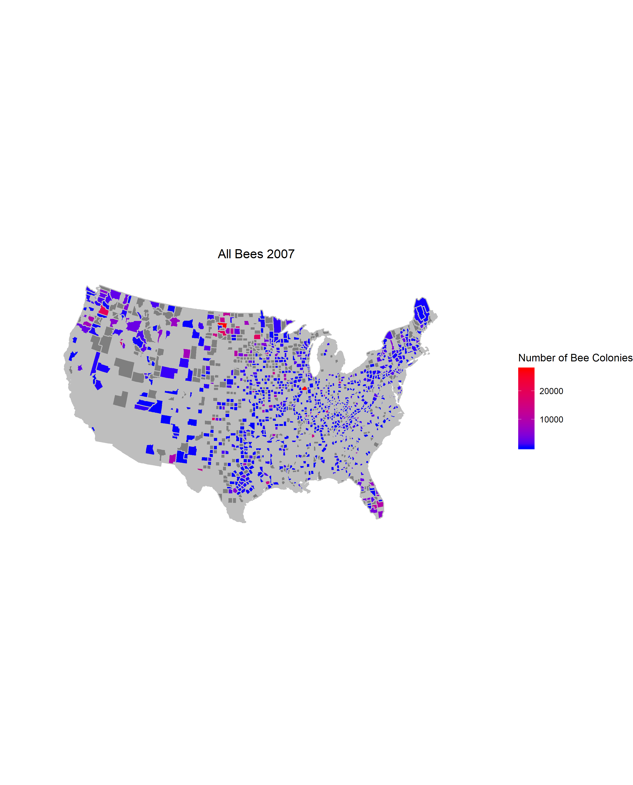
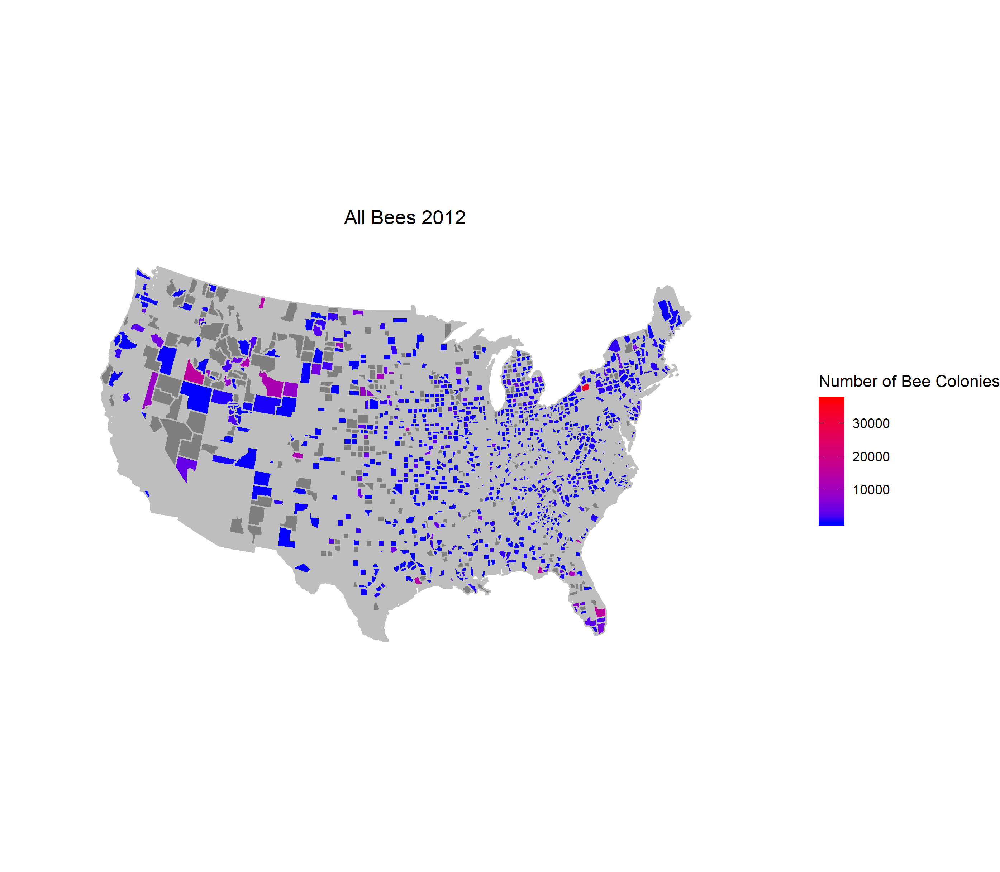
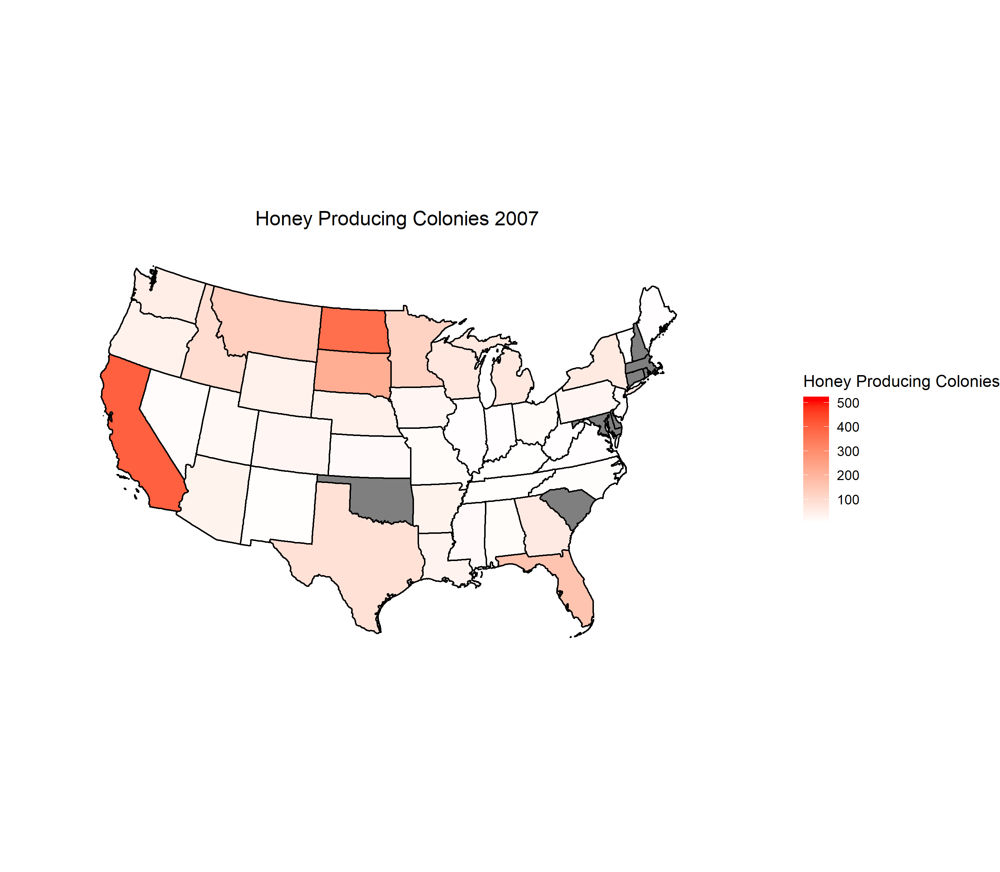
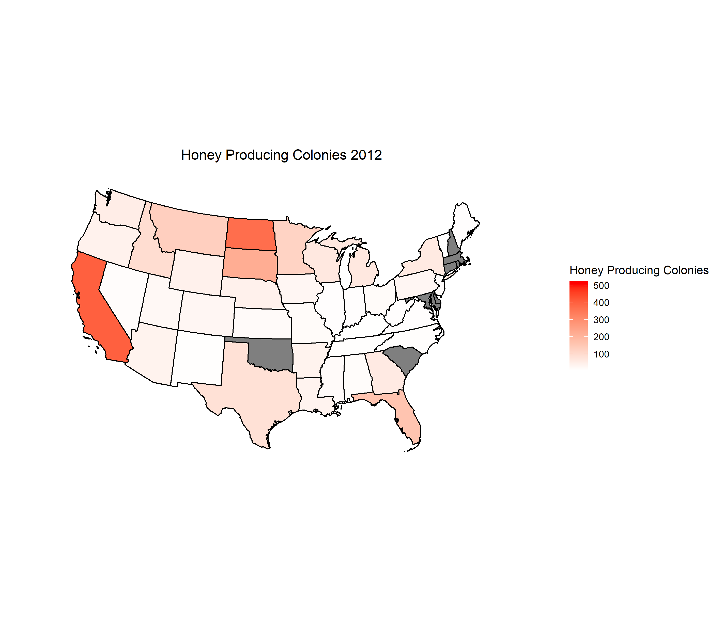
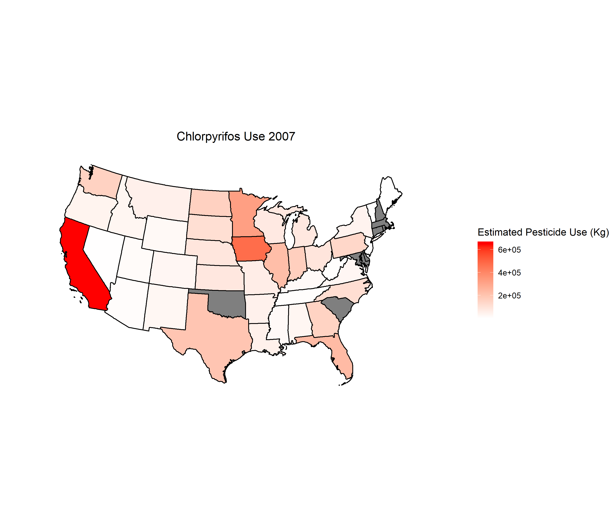
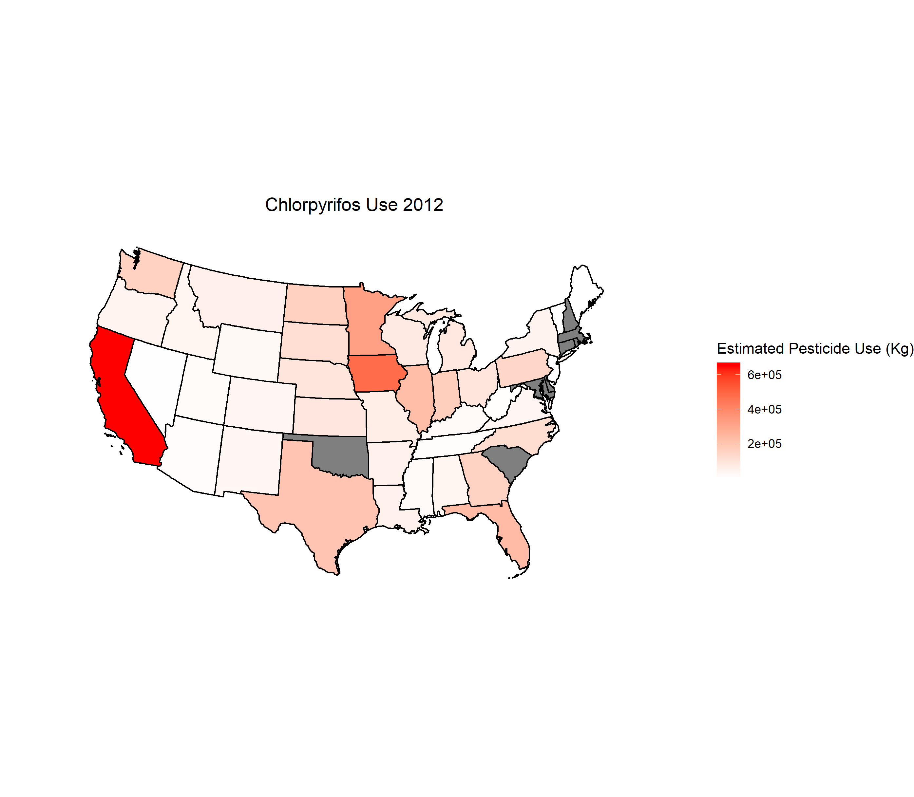

<br>

```{r, echo=FALSE, results='hide', message=FALSE}
library(tidyverse)
library(viridis)
library(ggplot2)
library(gganimate)
library(geojsonio)
library(RColorBrewer)
library(rgdal)
library(patchwork)

knitr::opts_chunk$set(
	echo = TRUE,
	warning = FALSE,
	fig.width = 8, 
  fig.height = 6,
  out.width = "90%"
)
options(
  ggplot2.continuous.colour = "viridis",
  ggplot2.continuous.fill = "viridis"
)
scale_colour_discrete = scale_colour_viridis_d
scale_fill_discrete = scale_fill_viridis_d
theme_set(theme_bw() + theme(legend.position = "bottom"))
knitr::opts_chunk$set(echo = TRUE)
```

**Pearson Correlation Coefficients for Total Pesticide Use and Bee Population by State**

To understand the effect of the pesticide use trends in the United States and the potential effect on bee population for each state, we calculated the Pearson Correlation for the time period of 2004-2016.


<center>


*Asterix indicate states with less than 10 full years of data*
<br>


<center>


Maryland clearly has the highest correlation with a coefficient close to 1. It is important to note that this does not indicate that between the years 2004 - 2016 bee population steadily decreased. Maryland only reported data from years 2004 and 2005. For all of the very high state correlation values (> 0.7), it is missing data driving the strong correlation instead of a trend over the years. 

Vermont has a strong negative correlation as well as complete pesticide and bee population data. Trends over the years are plotted below. 




<br>

The increase in bee population in the state tends to steadily decrease until 2014 while pesticide use increases until 2012. The resulting negative correlation is observed in the correlation plots above. 

<br>

**Selected maps**

Maps for the pesticides with the highest total use, Chlorpyrifos and Chlorthalonil, are displayed here. Data is displayed for 2007 and 2012, as those were the years with available county level data.


**County Level Maps**






<br>

**State Level Maps**

<br> 






*Pesticides*






