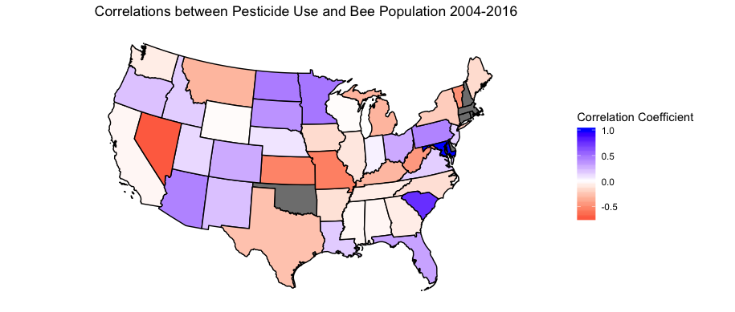

<br>

```{r, echo=FALSE, results='hide', message=FALSE}
library(tidyverse)
library(viridis)
library(ggplot2)
library(gganimate)
library(geojsonio)
library(RColorBrewer)
library(rgdal)
library(patchwork)

knitr::opts_chunk$set(
	echo = TRUE,
	warning = FALSE,
	fig.width = 8, 
  fig.height = 6,
  out.width = "90%"
)
options(
  ggplot2.continuous.colour = "viridis",
  ggplot2.continuous.fill = "viridis"
)
scale_colour_discrete = scale_colour_viridis_d
scale_fill_discrete = scale_fill_viridis_d
theme_set(theme_bw() + theme(legend.position = "bottom"))
knitr::opts_chunk$set(echo = TRUE)
```

**Pearson Correlation Coefficients for Total Pesticide Use and Bee Population by State**

To understand the effect of the pesticide use trends in the United States and the potential effect on bee population for each state, we calculated the Pearson Correlation for the time period of 2004-2016.

```{r,echo=FALSE, message=FALSE}

state_correlations= read_csv("./data/state_correlations.csv")
state_correlations = 
  state_correlations %>%
  ungroup(cor)

edit_state_corr = read_csv("./data/working_cor_data.csv")
edit_state_corr %>%
  mutate(state = fct_reorder(state, cor)) %>%
  ggplot(aes(x = state, y = cor)) +
  geom_point() +
  labs(x = "State", y = "Correlation", title= "Correlation of Pesticide Use and Bee Population 2004-2016") + 
  theme(axis.text.x = element_text(angle = 90)) +
  geom_hline(yintercept = 0, col = "red")
```
</center>
Figure 7: Correlation of Pesticide Use and Bee Population

<br>

</left>
The map below shows the correlations for pesticide use across the country.
<center>


Maryland clearly has the highest correlation with a coefficient close to 1. It is important to note that this does not indicate that between the years 2004 - 2016 bee population steadily decreased. Maryland only reported data from years 2004 and 2005. For all of the very high state correlation values (> 0.7), it is missing data driving the strong correlation instead of a trend over the years. 

The State with the most negative correlation as well as complete pesticide and bee population data is Missouri. Trends over the years are plotted below. 

```{r,echo=FALSE, message=FALSE}
merged_state_data = read.csv("./data/merged_state_data.csv")

vermont_pest = 
  merged_state_data %>%
  filter(state == "Vermont") %>%
  group_by(year.x) %>%
  summarise(n = sum(high)) %>%
   ggplot(aes(x = year.x, y = n)) + 
   geom_point() + 
   geom_smooth(se = FALSE) +
      theme(axis.text.x = element_text(angle = 90)) +
   labs(
     title = "Pesticides in Vermont",
     x = "Year",
     y = "Vermont Pesticide Use (kg)") +
   scale_x_continuous(
      breaks = c(2002, 2007, 2012, 2017))

vermont_bee = 
merged_state_data %>%
  filter(state == "Vermont") %>%
  group_by(year.x) %>%
  summarise(n = sum(honey_producing_colonies)) %>%
   ggplot(aes(x = year.x, y = n)) + 
   geom_point() + 
   geom_smooth(se = FALSE) +
    theme(axis.text.x = element_text(angle = 90)) +
   labs(
     title = "Honey Bee Colony Count in Vermont",
     x = "Year",
     y = "Vermont Honey Bee Colonies") +
   scale_x_continuous(
      breaks = c(2002, 2007, 2012, 2017))

(vermont_pest + vermont_bee)
```

*Figure 9: Vermont Bee Population and Pesticide Use*
<br>

The increase in bee population in the state tends to steadily decrease until 2014 while pesticide use is the inverse. The negative correlation is observed in the correlation plots above. 

<br>

**Selected maps**

Maps for the pesticides with the highest total use, Chlorpyrifos and Chlorthalonil, are displayed here. Data is displayed for 2007 and 2012, as those were the years with available county level data.

```{r, include=FALSE}
library(plotly)
library(ggmap)
library(maps)
library(choroplethrMaps)


knitr::opts_chunk$set(
	echo = TRUE,
	warning = FALSE
)
options(
  ggplot2.continuous.colour = "viridis",
  ggplot2.continuous.fill = "viridis"
)
scale_colour_discrete = scale_colour_viridis_d
scale_fill_discrete = scale_fill_viridis_d
theme_set(theme_bw() + theme(legend.position = "bottom"))
```


```{r read in data,include=FALSE}
merged_county_data = read_csv("./data/merged_county_data.csv") %>%
  janitor::clean_names() %>%
  rename(year = year_x) %>%
  mutate(
    county = str_to_lower(county)
  )

merged_state_data = read_csv("./data/merged_state_data.csv") %>%
  janitor::clean_names() %>%
  rename(year = year_x)

```


```{r, include = FALSE}
state.map <- map_data("state")
counties <- map_data("county")

merged_county_data_for_join =
  merged_county_data %>%
  rename(subregion = county)

county_2 <- merged_county_data_for_join %>%
  left_join(counties, "subregion")

```


```{r making each pesticide data file, include=FALSE}

CHLORPYRIFOS_2007 =
  county_2 %>%
  filter(compound=="CHLORPYRIFOS", year =="2007")

CHLORPYRIFOS_2012 =
  county_2 %>%
  filter(compound=="CHLORPYRIFOS", year =="2012")


CHLOROTHALONIL_2007 =
  county_2 %>%
  filter(compound=="CHLOROTHALONIL", year =="2007")

CHLOROTHALONIL_2012 =
  county_2 %>%
  filter(compound=="CHLOROTHALONIL", year =="2012")


```

**County Level Maps**

<br>

*Pesticides*

```{r building base and pesticide maps, include = FALSE}

counties_base <- ggplot(data = counties, mapping = aes(x = long, y = lat, group = group)) + 
  coord_fixed(1.3) + 
  geom_polygon(color = "black", fill = "gray")

CHLORPYRIFOS_map_2007 <- counties_base + theme_nothing() + 
  geom_polygon(data = CHLORPYRIFOS_2007, aes(fill= epest_high_kg), color = "white") + geom_polygon(color = "gray", fill = NA) +
      theme_void() + labs(title= "Chlorpyrifos, 2007 County Level Data", fill = "Estimated Pesticide Use (Kg)") + coord_map(projection = "bonne", lat0 = 50) + theme(plot.title = element_text(hjust = 0.5)) + scale_fill_gradient(low = "blue", high = "red")


CHLORPYRIFOS_map_2012 <- counties_base + theme_nothing() + 
  geom_polygon(data = CHLORPYRIFOS_2012, aes(fill= epest_high_kg), color = "white") + geom_polygon(color = "gray", fill = NA) +
      theme_void() + labs(title= "Chlorpyrifos, 2012 County Level Data", fill = "Estimated Pesticide Use (Kg)") + coord_map(projection = "bonne", lat0 = 50) + theme(plot.title = element_text(hjust = 0.5)) + scale_fill_gradient(low = "blue", high = "red")


CHLOROTHALONIL_map_2007 <- counties_base + theme_nothing() + 
  geom_polygon(data = CHLOROTHALONIL_2007, aes(fill= epest_high_kg), color = "white") + geom_polygon(color = "gray", fill = NA) +
      theme_void() + labs(title= "Chlorothalonil, 2007 County Level Data", fill = "Estimated Pesticide Use (Kg)") + coord_map(projection = "bonne", lat0 = 50) + theme(plot.title = element_text(hjust = 0.5)) + scale_fill_gradient(low = "blue", high = "red")

CHLOROTHALONIL_map_2012 <- counties_base + theme_nothing() + 
  geom_polygon(data = CHLOROTHALONIL_2012, aes(fill= epest_high_kg), color = "white") + geom_polygon(color = "gray", fill = NA) +
      theme_void() + labs(title= "Chlorothalonil, 2012 County Level Data", fill = "Estimated Pesticide Use (Kg)") + coord_map(projection = "bonne", lat0 = 50) + theme(plot.title = element_text(hjust = 0.5)) + scale_fill_gradient(low = "blue", high = "red")

```


```{r printing maps of top two pesticides, echo=FALSE, message=FALSE}
CHLOROTHALONIL_map_2007
CHLOROTHALONIL_map_2012
CHLORPYRIFOS_map_2007
CHLORPYRIFOS_map_2012
```


*All Bees*

```{r, include = FALSE}
county_2_2007 =
  county_2 %>%
  filter(year == "2007")

county_2_2012 =
  county_2 %>%
  filter(year == "2012")


map_county_bees_2007 <- counties_base + theme_nothing() + 
  geom_polygon(data = county_2_2007, aes(fill= colony_count), color = "white") + geom_polygon(color = "gray", fill = NA) +
      theme_void() + labs(title= "All Bees 2007", fill = "Number of Bee Colonies") + coord_map(projection = "bonne", lat0 = 50) + theme(plot.title = element_text(hjust = 0.5)) + scale_fill_gradient(low = "blue", high = "red")

map_county_bees_2012 <- counties_base + theme_nothing() + 
  geom_polygon(data = county_2_2012, aes(fill= colony_count), color = "white") + geom_polygon(color = "gray", fill = NA) +
      theme_void() + labs(title= "All Bees 2012", fill = "Number of Bee Colonies") + coord_map(projection = "bonne", lat0 = 50) + theme(plot.title = element_text(hjust = 0.5)) + scale_fill_gradient(low = "blue", high = "red")

```

```{r, echo = FALSE, message=FALSE}
map_county_bees_2007
map_county_bees_2012 

```

<br>

**State level maps**

<br> 

*Pesticides*

```{r state chlorpyrifos, include = FALSE}
state_chlorpyrifos =
  merged_state_data %>%
  mutate(state = str_to_lower(state)) %>%
  rename(region = state) %>%
  filter(compound == "CHLORPYRIFOS") %>%
  filter(year == "2007" | year == "2012")

state_map_chlorpyrifos = left_join(state.map, state_chlorpyrifos, by = "region") 

state_map_chlorpyrifos_2007 =
  state_map_chlorpyrifos %>%
  filter(year == "2007")

state_map_chlorpyrifos_2012 =
  state_map_chlorpyrifos %>%
  filter(year == "2007")


chlorpyrifos_map_state_2007 =
  ggplot(state_map_chlorpyrifos_2007, aes(long, lat, group = group, fill = high)) + geom_polygon(color = "black") + theme_void() + labs(title = "Chlorpyrifos Use, 2007 State Level", fill = "Estimated Pesticide Use (Kg)") +  coord_map(projection = "bonne", lat0 = 50) + theme(plot.title = element_text(hjust = 0.5)) + scale_fill_gradient(low = "white", high = "red")

chlorpyrifos_map_state_2012 =
  ggplot(state_map_chlorpyrifos_2012, aes(long, lat, group = group, fill = high)) + geom_polygon(color = "black") + theme_void() + labs(title = "Chlorpyrifos Use, 2012 State Level", fill = "Estimated Pesticide Use (Kg)") +  coord_map(projection = "bonne", lat0 = 50) + theme(plot.title = element_text(hjust = 0.5)) + scale_fill_gradient(low = "white", high = "red")

```

```{r state chlorothalonil, include = FALSE}
state_chlorothalonil =
  merged_state_data %>%
  mutate(state = str_to_lower(state)) %>%
  rename(region = state) %>%
  filter(compound == "CHLOROTHALONIL") %>%
  filter(year == "2007" | year == "2012")


state_map_chlorothalonil = left_join(state.map, state_chlorpyrifos, by = "region") 

state_map_chlorothalonil_2007 = 
  state_map_chlorothalonil %>%
    filter(year == "2007")

state_map_chlorothalonil_2012 = 
  state_map_chlorothalonil %>%
    filter(year == "2012")

chlorothalonil_map_state_2007 =
  ggplot(state_map_chlorothalonil_2007, aes(long, lat, group = group, fill = high)) + geom_polygon(color = "black") + theme_void() + labs(title = "Chlorothalonil Use, 2007 State Level", fill = "Estimated Pesticide Use (Kg)") +  coord_map(projection = "bonne", lat0 = 50) + theme(plot.title = element_text(hjust = 0.5)) + scale_fill_gradient(low = "white", high = "red")

chlorothalonil_map_state_2012 =
  ggplot(state_map_chlorothalonil_2012, aes(long, lat, group = group, fill = high)) + geom_polygon(color = "black") + theme_void() + labs(title = "Chlorothalonil Use, 2012 State Level", fill = "Estimated Pesticide Use (Kg)") +  coord_map(projection = "bonne", lat0 = 50) + theme(plot.title = element_text(hjust = 0.5)) + scale_fill_gradient(low = "white", high = "red")


```


```{r printing state maps of top two pesticides, echo=FALSE, message=FALSE}

chlorothalonil_map_state_2007
chlorothalonil_map_state_2012
chlorpyrifos_map_state_2007
chlorpyrifos_map_state_2012

```


<br>

*Honey Bees*

```{r state bees, include = FALSE}
merged_state_data = read_csv("./data/merged_state_data.csv")

merged_state_data_map =
  merged_state_data %>%
  mutate(state = str_to_lower(state)) %>%
  rename(region = state) %>%
  rename(year = year.x) %>%
  filter(year == "2007" | year == "2012")


state_map_data = left_join(state.map, merged_state_data_map, by = "region")

state_map_data_2007 =
  state_map_data %>%
  filter(year == "2007")

state_map_data_2012 =
  state_map_data %>%
  filter(year == "2012")

honey_bee_colony_map_2007 = 
  ggplot(state_map_data_2007, aes(long, lat, group = group, fill = honey_producing_colonies)) + geom_polygon(color = "black") + theme_void() + labs(title = "Honey Producing Colonies 2007", fill = "Honey Producing Colonies") + coord_map(projection = "bonne", lat0 = 50) + theme(plot.title = element_text(hjust = 0.5)) + scale_fill_gradient(low = "white", high = "red")

honey_bee_colony_map_2012 = 
  ggplot(state_map_data_2012, aes(long, lat, group = group, fill = honey_producing_colonies)) + geom_polygon(color = "black") + theme_void() + labs(title = "Honey Producing Colonies 2012", fill = "Honey Producing Colonies") + coord_map(projection = "bonne", lat0 = 50) + theme(plot.title = element_text(hjust = 0.5)) + scale_fill_gradient(low = "white", high = "red")


```

```{r, echo=FALSE, message=FALSE}
honey_bee_colony_map_2007 
honey_bee_colony_map_2012

```


