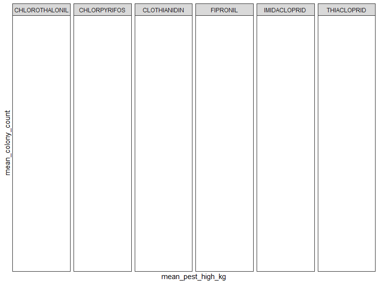

Data Processing
================

``` r
county_fips = read_csv("./data/all-geocodes-v2016.csv", skip = 4) %>%
  janitor::clean_names() %>%
  rename(county_name = area_name_including_legal_statistical_area_description) %>%
  filter(county_code_fips != "000") %>%
  mutate(state_county_fips = paste0(state_code_fips, county_code_fips)) %>%
  select (state_code_fips, county_code_fips, state_county_fips, county_name)
```

    ## Parsed with column specification:
    ## cols(
    ##   `Summary Level` = col_character(),
    ##   `State Code (FIPS)` = col_character(),
    ##   `County Code (FIPS)` = col_character(),
    ##   `County Subdivision Code (FIPS)` = col_character(),
    ##   `Place Code (FIPS)` = col_character(),
    ##   `Consolidtated City Code (FIPS)` = col_character(),
    ##   `Area Name (including legal/statistical area description)` = col_character()
    ## )

``` r
state_fips = read_csv("./data/state-geocodes-v2016.csv", skip = 5) %>%
  janitor::clean_names() %>%
  filter(state_fips != "00") %>%
  select(state_fips, name) %>%
  mutate(state_fips = as.numeric(state_fips)) %>%
  rename(state = name)
```

    ## Parsed with column specification:
    ## cols(
    ##   Region = col_double(),
    ##   Division = col_double(),
    ##   `State (FIPS)` = col_character(),
    ##   Name = col_character()
    ## )

``` r
bee_county = read_csv("./data/bee_county/Bee_Colony_Census_Data_by_County 2.csv") %>% 
  janitor::clean_names() %>% 
  select(year, 
         state, 
         state_ansi, 
         ag_district, 
         ag_district_code, 
         county, 
         county_ansi, 
         value, 
         cv_percent) 
```

    ## Parsed with column specification:
    ## cols(
    ##   Year = col_double(),
    ##   Period = col_character(),
    ##   State = col_character(),
    ##   `State ANSI` = col_double(),
    ##   `Ag District` = col_character(),
    ##   `Ag District Code` = col_double(),
    ##   County = col_character(),
    ##   `County ANSI` = col_double(),
    ##   Value = col_character(),
    ##   `CV (%)` = col_character()
    ## )

``` r
 bee_county$state_ansi = stringr::str_pad(bee_county$state_ansi,2 , pad = "0")
bee_county$county_ansi = stringr::str_pad(bee_county$county_ansi,3 , pad = "0")

bee_county = bee_county%>% 
  mutate(state_county_fips = paste0(state_ansi, county_ansi),
    value = replace(value, value == "(D)", "NA"),
    cv_percent = replace(cv_percent, cv_percent == "(D)", "NA")) %>% 
  rename (colony_count = value)
```

``` r
#create function to import data
file_name <- list.files(path = "./data/bee_state_2/") 

df = read_csv(file = str_c("./data/bee_state_2/", file_name[1])) %>%
  mutate(file = file_name[1])
```

    ## Parsed with column specification:
    ## cols(
    ##   `2` = col_double(),
    ##   t = col_character(),
    ##   `Honey: Released February 28, 2002, by the National Agricultural Statistics Service (NASS), Agricultural Statistics Board, U.S. Department of Agriculture.` = col_character(),
    ##   X4 = col_character(),
    ##   X5 = col_character(),
    ##   X6 = col_character(),
    ##   X7 = col_character(),
    ##   X8 = col_character(),
    ##   X9 = col_character()
    ## )

``` r
  df
```

    ## # A tibble: 51 x 10
    ##      `2` t     `Honey: Released … X4    X5    X6    X7    X8    X9    file 
    ##    <dbl> <chr> <chr>              <chr> <chr> <chr> <chr> <chr> <chr> <chr>
    ##  1     2 t     Honey:  Number of… <NA>  <NA>  <NA>  <NA>  <NA>  <NA>  2002…
    ##  2     2 t     and Value by Stat… <NA>  <NA>  <NA>  <NA>  <NA>  <NA>  2002…
    ##  3     2 h     <NA>               <NA>  <NA>  <NA>  <NA>  <NA>  <NA>  2002…
    ##  4     2 h     <NA>               Honey Yield <NA>  <NA>  Aver… Value 2002…
    ##  5     2 h     State              Prod… per   Prod… Stoc… Pric… of    2002…
    ##  6     2 h     <NA>               Colo… Colo… <NA>  Dec … Poun… Prod… 2002…
    ##  7     2 h     <NA>               <NA>  <NA>  <NA>  <NA>  <NA>  <NA>  2002…
    ##  8     2 u     <NA>               1,000 Poun… 1,00… 1,00… Cents 1,00… 2002…
    ##  9     2 d     AL                 16    78    1248  187   59    736   2002…
    ## 10     2 d     AZ                 40    59    2360  1322  73    1723  2002…
    ## # … with 41 more rows

``` r
my_read_csv = function(x){
    df = read_csv(x, skip = 9, col_names  = F)
}
  
bee_data = 
  tibble(
    file_names = file_name,
    path = str_c("./data/bee_state_2/", file_names)
  ) %>% 
  mutate(data = map(path, my_read_csv))%>% 
  unnest()
```

    ## Parsed with column specification:
    ## cols(
    ##   X1 = col_double(),
    ##   X2 = col_character(),
    ##   X3 = col_character(),
    ##   X4 = col_double(),
    ##   X5 = col_double(),
    ##   X6 = col_double(),
    ##   X7 = col_double(),
    ##   X8 = col_double(),
    ##   X9 = col_double()
    ## )

    ## Parsed with column specification:
    ## cols(
    ##   X1 = col_double(),
    ##   X2 = col_character(),
    ##   X3 = col_character(),
    ##   X4 = col_double(),
    ##   X5 = col_double(),
    ##   X6 = col_double(),
    ##   X7 = col_double(),
    ##   X8 = col_double(),
    ##   X9 = col_double()
    ## )
    ## Parsed with column specification:
    ## cols(
    ##   X1 = col_double(),
    ##   X2 = col_character(),
    ##   X3 = col_character(),
    ##   X4 = col_double(),
    ##   X5 = col_double(),
    ##   X6 = col_double(),
    ##   X7 = col_double(),
    ##   X8 = col_double(),
    ##   X9 = col_double()
    ## )
    ## Parsed with column specification:
    ## cols(
    ##   X1 = col_double(),
    ##   X2 = col_character(),
    ##   X3 = col_character(),
    ##   X4 = col_double(),
    ##   X5 = col_double(),
    ##   X6 = col_double(),
    ##   X7 = col_double(),
    ##   X8 = col_double(),
    ##   X9 = col_double()
    ## )
    ## Parsed with column specification:
    ## cols(
    ##   X1 = col_double(),
    ##   X2 = col_character(),
    ##   X3 = col_character(),
    ##   X4 = col_double(),
    ##   X5 = col_double(),
    ##   X6 = col_double(),
    ##   X7 = col_double(),
    ##   X8 = col_double(),
    ##   X9 = col_double()
    ## )
    ## Parsed with column specification:
    ## cols(
    ##   X1 = col_double(),
    ##   X2 = col_character(),
    ##   X3 = col_character(),
    ##   X4 = col_double(),
    ##   X5 = col_double(),
    ##   X6 = col_double(),
    ##   X7 = col_double(),
    ##   X8 = col_double(),
    ##   X9 = col_double()
    ## )
    ## Parsed with column specification:
    ## cols(
    ##   X1 = col_double(),
    ##   X2 = col_character(),
    ##   X3 = col_character(),
    ##   X4 = col_double(),
    ##   X5 = col_double(),
    ##   X6 = col_double(),
    ##   X7 = col_double(),
    ##   X8 = col_double(),
    ##   X9 = col_double()
    ## )
    ## Parsed with column specification:
    ## cols(
    ##   X1 = col_double(),
    ##   X2 = col_character(),
    ##   X3 = col_character(),
    ##   X4 = col_double(),
    ##   X5 = col_double(),
    ##   X6 = col_double(),
    ##   X7 = col_double(),
    ##   X8 = col_double(),
    ##   X9 = col_double()
    ## )
    ## Parsed with column specification:
    ## cols(
    ##   X1 = col_double(),
    ##   X2 = col_character(),
    ##   X3 = col_character(),
    ##   X4 = col_double(),
    ##   X5 = col_double(),
    ##   X6 = col_double(),
    ##   X7 = col_double(),
    ##   X8 = col_double(),
    ##   X9 = col_double()
    ## )
    ## Parsed with column specification:
    ## cols(
    ##   X1 = col_double(),
    ##   X2 = col_character(),
    ##   X3 = col_character(),
    ##   X4 = col_double(),
    ##   X5 = col_double(),
    ##   X6 = col_double(),
    ##   X7 = col_double(),
    ##   X8 = col_double(),
    ##   X9 = col_double()
    ## )
    ## Parsed with column specification:
    ## cols(
    ##   X1 = col_double(),
    ##   X2 = col_character(),
    ##   X3 = col_character(),
    ##   X4 = col_double(),
    ##   X5 = col_double(),
    ##   X6 = col_double(),
    ##   X7 = col_double(),
    ##   X8 = col_double(),
    ##   X9 = col_double()
    ## )
    ## Parsed with column specification:
    ## cols(
    ##   X1 = col_double(),
    ##   X2 = col_character(),
    ##   X3 = col_character(),
    ##   X4 = col_double(),
    ##   X5 = col_double(),
    ##   X6 = col_double(),
    ##   X7 = col_double(),
    ##   X8 = col_double(),
    ##   X9 = col_double()
    ## )
    ## Parsed with column specification:
    ## cols(
    ##   X1 = col_double(),
    ##   X2 = col_character(),
    ##   X3 = col_character(),
    ##   X4 = col_double(),
    ##   X5 = col_double(),
    ##   X6 = col_double(),
    ##   X7 = col_double(),
    ##   X8 = col_double(),
    ##   X9 = col_double()
    ## )
    ## Parsed with column specification:
    ## cols(
    ##   X1 = col_double(),
    ##   X2 = col_character(),
    ##   X3 = col_character(),
    ##   X4 = col_double(),
    ##   X5 = col_double(),
    ##   X6 = col_double(),
    ##   X7 = col_double(),
    ##   X8 = col_double(),
    ##   X9 = col_double()
    ## )
    ## Parsed with column specification:
    ## cols(
    ##   X1 = col_double(),
    ##   X2 = col_character(),
    ##   X3 = col_character(),
    ##   X4 = col_double(),
    ##   X5 = col_double(),
    ##   X6 = col_double(),
    ##   X7 = col_double(),
    ##   X8 = col_double(),
    ##   X9 = col_double()
    ## )
    ## Parsed with column specification:
    ## cols(
    ##   X1 = col_double(),
    ##   X2 = col_character(),
    ##   X3 = col_character(),
    ##   X4 = col_double(),
    ##   X5 = col_double(),
    ##   X6 = col_double(),
    ##   X7 = col_double(),
    ##   X8 = col_double(),
    ##   X9 = col_double()
    ## )
    ## Parsed with column specification:
    ## cols(
    ##   X1 = col_double(),
    ##   X2 = col_character(),
    ##   X3 = col_character(),
    ##   X4 = col_double(),
    ##   X5 = col_double(),
    ##   X6 = col_double(),
    ##   X7 = col_double(),
    ##   X8 = col_double(),
    ##   X9 = col_double()
    ## )
    ## Parsed with column specification:
    ## cols(
    ##   X1 = col_double(),
    ##   X2 = col_character(),
    ##   X3 = col_character(),
    ##   X4 = col_double(),
    ##   X5 = col_double(),
    ##   X6 = col_double(),
    ##   X7 = col_double(),
    ##   X8 = col_double(),
    ##   X9 = col_double()
    ## )

``` r
#clean data set
clean_bee_data =
  bee_data %>%
 separate(file_names, into = c("year", "remove"), sep = ".c") %>%
  select(-remove, -X1, -X2, -path) %>%
  rename(state = X3, honey_producing_colonies = X4, yield_per_colony = X5, production = X6, stocks = X7, price_per_pound = X8, production_value = X9) %>%
  drop_na(state) %>%
  mutate(state = recode(state, AL = "Alabama", AR = "Arkansas", AZ = "Arizona", CA = "California", CO = "Colorado", FL = "Florida", GA = "Georgia", HI = "Hawaii", IA = "Iowa", IL = "Illinois", ID = "Idaho", IN = "Indiana", KS = "Kansas", KY = "Kentucky", LA = "Louisiana", ME = "Maine", MD = "Maryland", MI = "Michigan", MN = "Minnesota", MO = "Missouri", MT = "Montana", MS = "Mississippi", NC = "North Carolina", ND = "North Dakota", NE = "Nebraska", NJ = "New Jersey", NM = "New Mexico", NV = "Nevada", NY = "New York", OH = "Ohio", OK = "Oklahoma", OR = "Oregon", PA = "Pennsylvania", SC = "South Carolina", SD = "South Dakota", TN = "Tennessee", TX = "Texas", UT = "Utah", VA = "Virginia", VT = "Vermont", WA = "Washington", WV = "West Virginia", WI = "Wisconsin", WY = "Wyoming"))
```

``` r
pest_2002 = read_excel("./data/pesticides_csv/EPest.county.estimates.2002.xlsx") %>% 
  janitor::clean_names() %>% 
  mutate(
    state_fips = state_fips_code,
    county_fips = county_fips_code,
    state_county_fips = paste0(state_fips, county_fips),
    epest_low_kg = round(epest_low_kg),
    epest_high_kg = round(epest_high_kg)) %>%
  select(-state_fips_code, -county_fips_code)
    
pest_2002 %>% 
  group_by(year, state_county_fips, compound) %>% 
  ggplot(aes(x = compound, y = epest_high_kg)) + 
  geom_col() 

unique(pull(pest_2002, compound))
```

``` r
state_bee_fips = full_join(clean_bee_data, state_fips, by = "state")

top_pesticides = read_csv("./data/top_pesticides.csv") %>%
    mutate(state_fips = as.numeric(state_fips))
```

    ## Parsed with column specification:
    ## cols(
    ##   X1 = col_double(),
    ##   compound = col_character(),
    ##   year = col_double(),
    ##   epest_low_kg = col_double(),
    ##   epest_high_kg = col_double(),
    ##   state_fips = col_character(),
    ##   county_fips = col_character(),
    ##   state_county_fips = col_character()
    ## )

``` r
state_pest_data = 
  top_pesticides %>%
  group_by(state_fips, year, compound) %>%
  summarize(low = sum(epest_low_kg), high = sum(epest_high_kg)) 
```

``` r
state_bee_yrfips = 
  state_bee_fips %>%
  mutate(state_year_fips = paste0(year, state_fips))

state_pest_yrfips = 
  state_pest_data %>%
  mutate(state_year_fips = paste0(year, state_fips))

merged_state_data = full_join(state_bee_yrfips, state_pest_yrfips, by = "state_year_fips") %>%
  select(year.x, state, state_fips.x, honey_producing_colonies, yield_per_colony, production, compound, low, high) %>%
   rename(state_fips = state_fips.x) %>%
  drop_na(year.x, state, compound, high)
```

``` r
county_bee_yrfips = 
  bee_county %>%
  mutate(county_year_fips = paste0(year, state_county_fips), 
         state_year_fips = paste0(year, state_ansi))
         
county_pest_yrfips = 
  top_pesticides %>%
  mutate(state_county_fips = as.numeric(state_county_fips) ,
         county_year_fips = paste0(year, state_county_fips)
         )

merged_county_data = full_join(county_bee_yrfips, county_pest_yrfips, by = "county_year_fips") %>%
  select(year.x, state, county, county_fips, colony_count, compound, epest_low_kg, epest_high_kg, state_year_fips) %>%
  drop_na(year.x, state, county, colony_count, compound, epest_high_kg)
```

``` r
pest_miss = read_csv("./data/top_pesticides.csv") %>% 
  group_by(compound) %>% 
  summarise(missing = sum(is.na(epest_high_kg))) 
```

    ## Parsed with column specification:
    ## cols(
    ##   X1 = col_double(),
    ##   compound = col_character(),
    ##   year = col_double(),
    ##   epest_low_kg = col_double(),
    ##   epest_high_kg = col_double(),
    ##   state_fips = col_character(),
    ##   county_fips = col_character(),
    ##   state_county_fips = col_character()
    ## )

``` r
pest_miss 
```

    ## # A tibble: 6 x 2
    ##   compound       missing
    ##   <chr>            <int>
    ## 1 CHLOROTHALONIL       0
    ## 2 CHLORPYRIFOS         0
    ## 3 CLOTHIANIDIN         1
    ## 4 FIPRONIL             0
    ## 5 IMIDACLOPRID         4
    ## 6 THIACLOPRID          0

``` r
#All of our pesticides meet the 90% cutoff for completeness. Imidacloprid has the most missing values (n=4) out of 34,000+ observations. 

pest_zero = read_csv("./data/top_pesticides.csv") %>%
  mutate(epest_high_kg = na_if(epest_high_kg, "0")) %>%
  group_by(compound) %>% 
  summarise(missing = sum(is.na(epest_high_kg)))
```

    ## Parsed with column specification:
    ## cols(
    ##   X1 = col_double(),
    ##   compound = col_character(),
    ##   year = col_double(),
    ##   epest_low_kg = col_double(),
    ##   epest_high_kg = col_double(),
    ##   state_fips = col_character(),
    ##   county_fips = col_character(),
    ##   state_county_fips = col_character()
    ## )

``` r
pest_zero
```

    ## # A tibble: 6 x 2
    ##   compound       missing
    ##   <chr>            <int>
    ## 1 CHLOROTHALONIL    1012
    ## 2 CHLORPYRIFOS       525
    ## 3 CLOTHIANIDIN      3468
    ## 4 FIPRONIL          1750
    ## 5 IMIDACLOPRID      2848
    ## 6 THIACLOPRID       1803

``` r
#correlation of state level means across all years

corr_state = read_csv("./data/top_pesticides.csv") %>% 
  drop_na(epest_high_kg) %>%
  group_by(compound, state_fips) %>%
  summarise(mean_pest_high = mean(epest_high_kg, na.rm = TRUE)) %>% 
  pivot_wider(
    names_from = "compound",
    values_from = "mean_pest_high",
  ) %>% 
  select(-state_fips)
```

    ## Parsed with column specification:
    ## cols(
    ##   X1 = col_double(),
    ##   compound = col_character(),
    ##   year = col_double(),
    ##   epest_low_kg = col_double(),
    ##   epest_high_kg = col_double(),
    ##   state_fips = col_character(),
    ##   county_fips = col_character(),
    ##   state_county_fips = col_character()
    ## )

``` r
corr_state %>%
  view()

matrix_state_1 = cor(corr_state, use = "everything", method = c("pearson"))
matrix_state_1
```

    ##                CHLOROTHALONIL CHLORPYRIFOS CLOTHIANIDIN FIPRONIL
    ## CHLOROTHALONIL      1.0000000    0.4802217    0.0571605       NA
    ## CHLORPYRIFOS        0.4802217    1.0000000    0.5316680       NA
    ## CLOTHIANIDIN        0.0571605    0.5316680    1.0000000       NA
    ## FIPRONIL                   NA           NA           NA        1
    ## IMIDACLOPRID        0.4953138    0.8741880    0.3934778       NA
    ## THIACLOPRID                NA           NA           NA       NA
    ##                IMIDACLOPRID THIACLOPRID
    ## CHLOROTHALONIL    0.4953138          NA
    ## CHLORPYRIFOS      0.8741880          NA
    ## CLOTHIANIDIN      0.3934778          NA
    ## FIPRONIL                 NA          NA
    ## IMIDACLOPRID      1.0000000          NA
    ## THIACLOPRID              NA           1

``` r
matrix_state_2 = cor(corr_state, use = "complete.obs", method = c("pearson"))
matrix_state_2
```

    ##                CHLOROTHALONIL CHLORPYRIFOS CLOTHIANIDIN     FIPRONIL
    ## CHLOROTHALONIL      1.0000000   0.70246745    0.3117681 -0.122623772
    ## CHLORPYRIFOS        0.7024675   1.00000000    0.5756553  0.001349550
    ## CLOTHIANIDIN        0.3117681   0.57565529    1.0000000  0.506889870
    ## FIPRONIL           -0.1226238   0.00134955    0.5068899  1.000000000
    ## IMIDACLOPRID        0.6541162   0.97497272    0.5498456 -0.003886203
    ## THIACLOPRID         0.1766534   0.12367034   -0.1679516 -0.056247127
    ##                IMIDACLOPRID  THIACLOPRID
    ## CHLOROTHALONIL  0.654116214  0.176653447
    ## CHLORPYRIFOS    0.974972715  0.123670345
    ## CLOTHIANIDIN    0.549845616 -0.167951571
    ## FIPRONIL       -0.003886203 -0.056247127
    ## IMIDACLOPRID    1.000000000 -0.002073838
    ## THIACLOPRID    -0.002073838  1.000000000

``` r
pest_country_all = read_csv("./data/top_pesticides.csv") %>% 
  group_by(compound, year) %>%
  summarise(mean_pest_high = mean(epest_high_kg, na.rm = TRUE)) %>% 
  ggplot(aes(x = year, y = mean_pest_high, color = compound)) + 
  geom_line() 
```

    ## Parsed with column specification:
    ## cols(
    ##   X1 = col_double(),
    ##   compound = col_character(),
    ##   year = col_double(),
    ##   epest_low_kg = col_double(),
    ##   epest_high_kg = col_double(),
    ##   state_fips = col_character(),
    ##   county_fips = col_character(),
    ##   state_county_fips = col_character()
    ## )

``` r
pest_country_all 
```


``` r
#After looking at the graph above, I decided to remove Imidacloprid and Thiacloprid 

pest_country = read_csv("./data/top_pesticides.csv") %>% 
  filter(compound %in% c("CHLOROTHALONIL", "CHLORPYRIFOS", 
                         "CLOTHIANIDIN", "FIPRONIL")) %>%
  group_by(compound, year) %>%
  summarise(mean_pest_high = mean(epest_high_kg, na.rm = TRUE)) %>% 
  ggplot(aes(x = year, y = mean_pest_high, color = compound)) + 
  geom_line() 
```

    ## Parsed with column specification:
    ## cols(
    ##   X1 = col_double(),
    ##   compound = col_character(),
    ##   year = col_double(),
    ##   epest_low_kg = col_double(),
    ##   epest_high_kg = col_double(),
    ##   state_fips = col_character(),
    ##   county_fips = col_character(),
    ##   state_county_fips = col_character()
    ## )

``` r
pest_country 
```


``` r
pest_state_2004 = read_csv("./data/top_pesticides.csv") %>% 
  filter(compound %in% c("CHLOROTHALONIL", "CHLORPYRIFOS",
                         "CLOTHIANIDIN", "FIPRONIL"), year == 2004) %>%
  group_by(compound, state_fips) %>%
  summarise(tot_pest_high = sum(epest_high_kg)) %>% 
  ggplot(aes(x = state_fips, y = tot_pest_high, color = compound)) + 
  geom_point() 
```

    ## Parsed with column specification:
    ## cols(
    ##   X1 = col_double(),
    ##   compound = col_character(),
    ##   year = col_double(),
    ##   epest_low_kg = col_double(),
    ##   epest_high_kg = col_double(),
    ##   state_fips = col_character(),
    ##   county_fips = col_character(),
    ##   state_county_fips = col_character()
    ## )

``` r
pest_state_2004
```


``` r
pest_state_1 = read_csv("./data/top_pesticides.csv") %>% 
  filter(compound == "CHLOROTHALONIL") %>%
  group_by(year, state_fips) %>%
  summarise(tot_pest_high = sum(epest_high_kg)) %>% 
  ggplot(aes(x = year, y = tot_pest_high, color =state_fips)) + 
  geom_line() + 
  labs( 
    title = "Chlorothalonil use across states in 2004", 
    x = "Year",
    y = "Total Pesticide Use (Kg)")
```

    ## Parsed with column specification:
    ## cols(
    ##   X1 = col_double(),
    ##   compound = col_character(),
    ##   year = col_double(),
    ##   epest_low_kg = col_double(),
    ##   epest_high_kg = col_double(),
    ##   state_fips = col_character(),
    ##   county_fips = col_character(),
    ##   state_county_fips = col_character()
    ## )

``` r
pest_state_1
```


Looking at merged state data

``` r
summary(merged_state_data)
```

    ##     year.x             state             state_fips   
    ##  Length:2503        Length:2503        Min.   : 1.00  
    ##  Class :character   Class :character   1st Qu.:19.00  
    ##  Mode  :character   Mode  :character   Median :31.00  
    ##                                        Mean   :31.09  
    ##                                        3rd Qu.:46.00  
    ##                                        Max.   :56.00  
    ##                                                       
    ##  honey_producing_colonies yield_per_colony   production   
    ##  Min.   :  2.00           Min.   : 19.00   Min.   :   84  
    ##  1st Qu.:  9.00           1st Qu.: 45.00   1st Qu.:  459  
    ##  Median : 27.00           Median : 56.00   Median : 1550  
    ##  Mean   : 61.15           Mean   : 57.93   Mean   : 3906  
    ##  3rd Qu.: 65.00           3rd Qu.: 68.00   3rd Qu.: 3780  
    ##  Max.   :510.00           Max.   :124.00   Max.   :46410  
    ##                                                           
    ##    compound              low                 high        
    ##  Length:2503        Min.   :      0.0   Min.   :      0  
    ##  Class :character   1st Qu.:    742.8   1st Qu.:   1158  
    ##  Mode  :character   Median :   8517.0   Median :   8213  
    ##                     Mean   :  62555.0   Mean   :  52131  
    ##                     3rd Qu.:  48834.5   3rd Qu.:  45540  
    ##                     Max.   :1466223.0   Max.   :1468227  
    ##                     NA's   :1435

``` r
merged_state_data %>%
  group_by(compound, year.x) %>%
  summarize(mean_colony_count = mean(honey_producing_colonies),
         mean_pest_high_kg = mean(high)) %>%
  select(year.x, compound, mean_colony_count, mean_pest_high_kg) %>%
  knitr::kable(digits=2)
```

| year.x | compound       | mean\_colony\_count | mean\_pest\_high\_kg |
| :----- | :------------- | ------------------: | -------------------: |
| 2004   | CHLOROTHALONIL |               59.49 |             88468.95 |
| 2005   | CHLOROTHALONIL |               60.09 |             99930.16 |
| 2006   | CHLOROTHALONIL |               63.25 |            106147.10 |
| 2007   | CHLOROTHALONIL |               59.62 |            127448.55 |
| 2008   | CHLOROTHALONIL |               59.12 |            106846.62 |
| 2009   | CHLOROTHALONIL |               60.45 |            104185.02 |
| 2010   | CHLOROTHALONIL |               57.90 |            122511.48 |
| 2011   | CHLOROTHALONIL |               63.13 |            116520.49 |
| 2012   | CHLOROTHALONIL |               68.10 |            126408.97 |
| 2013   | CHLOROTHALONIL |               63.00 |            115444.08 |
| 2014   | CHLOROTHALONIL |               64.08 |            119310.95 |
| 2015   | CHLOROTHALONIL |               68.26 |            141246.00 |
| 2016   | CHLOROTHALONIL |               69.08 |            130352.00 |
| 2004   | CHLORPYRIFOS   |               59.49 |            104549.44 |
| 2005   | CHLORPYRIFOS   |               60.09 |            103115.07 |
| 2006   | CHLORPYRIFOS   |               63.25 |            105032.98 |
| 2007   | CHLORPYRIFOS   |               59.62 |            101325.95 |
| 2008   | CHLORPYRIFOS   |               59.12 |            146560.23 |
| 2009   | CHLORPYRIFOS   |               60.45 |            102064.55 |
| 2010   | CHLORPYRIFOS   |               57.90 |             87879.27 |
| 2011   | CHLORPYRIFOS   |               63.13 |             83918.82 |
| 2012   | CHLORPYRIFOS   |               68.10 |            109464.28 |
| 2013   | CHLORPYRIFOS   |               63.00 |            112382.59 |
| 2014   | CHLORPYRIFOS   |               64.08 |            116213.77 |
| 2015   | CHLORPYRIFOS   |               68.26 |            106157.76 |
| 2016   | CHLORPYRIFOS   |               69.08 |             87361.72 |
| 2004   | CLOTHIANIDIN   |               46.42 |              4884.40 |
| 2005   | CLOTHIANIDIN   |               51.52 |              7813.73 |
| 2006   | CLOTHIANIDIN   |               56.13 |              7080.89 |
| 2007   | CLOTHIANIDIN   |               60.95 |             10152.82 |
| 2008   | CLOTHIANIDIN   |               59.87 |             12918.87 |
| 2009   | CLOTHIANIDIN   |               60.45 |             14183.10 |
| 2010   | CLOTHIANIDIN   |               58.67 |             11911.69 |
| 2011   | CLOTHIANIDIN   |               63.13 |             21198.54 |
| 2012   | CLOTHIANIDIN   |               68.10 |             32759.74 |
| 2013   | CLOTHIANIDIN   |               63.00 |             39837.10 |
| 2014   | CLOTHIANIDIN   |               64.08 |             44439.77 |
| 2015   | CLOTHIANIDIN   |               64.10 |              5273.45 |
| 2016   | CLOTHIANIDIN   |               67.82 |              2581.46 |
| 2004   | FIPRONIL       |               51.00 |              5045.10 |
| 2005   | FIPRONIL       |               61.71 |              6735.04 |
| 2006   | FIPRONIL       |               68.71 |              2979.76 |
| 2007   | FIPRONIL       |               66.84 |              4034.74 |
| 2008   | FIPRONIL       |               65.20 |              2013.84 |
| 2009   | FIPRONIL       |               65.21 |              3165.43 |
| 2010   | FIPRONIL       |               70.33 |              2247.27 |
| 2011   | FIPRONIL       |               94.67 |              1819.29 |
| 2012   | FIPRONIL       |               75.79 |               523.21 |
| 2013   | FIPRONIL       |               53.93 |               326.33 |
| 2014   | FIPRONIL       |               83.79 |               495.57 |
| 2015   | FIPRONIL       |               84.69 |               279.69 |
| 2016   | FIPRONIL       |               87.31 |               247.31 |
| 2004   | IMIDACLOPRID   |               59.49 |              6295.58 |
| 2005   | IMIDACLOPRID   |               61.43 |              5119.00 |
| 2006   | IMIDACLOPRID   |               63.25 |              5452.25 |
| 2007   | IMIDACLOPRID   |               59.62 |              8308.92 |
| 2008   | IMIDACLOPRID   |               59.03 |              7942.79 |
| 2009   | IMIDACLOPRID   |               61.82 |              9847.33 |
| 2010   | IMIDACLOPRID   |               57.90 |             18865.38 |
| 2011   | IMIDACLOPRID   |               63.13 |             20565.23 |
| 2012   | IMIDACLOPRID   |               68.10 |             21167.00 |
| 2013   | IMIDACLOPRID   |               63.00 |             23691.23 |
| 2014   | IMIDACLOPRID   |               64.08 |             25955.82 |
| 2015   | IMIDACLOPRID   |               68.26 |             11658.32 |
| 2016   | IMIDACLOPRID   |               69.08 |             11433.49 |
| 2004   | THIACLOPRID    |               29.47 |               296.12 |
| 2005   | THIACLOPRID    |               28.47 |               422.65 |
| 2006   | THIACLOPRID    |               47.89 |               471.26 |
| 2007   | THIACLOPRID    |               51.75 |               385.06 |
| 2008   | THIACLOPRID    |               60.36 |               382.57 |
| 2009   | THIACLOPRID    |               30.73 |               590.93 |
| 2010   | THIACLOPRID    |               30.93 |               597.80 |
| 2011   | THIACLOPRID    |               32.13 |               529.07 |
| 2012   | THIACLOPRID    |               57.12 |               324.81 |
| 2013   | THIACLOPRID    |               30.86 |               776.57 |
| 2014   | THIACLOPRID    |               30.50 |               661.21 |
| 2015   | THIACLOPRID    |               32.77 |               335.38 |
| 2016   | THIACLOPRID    |               45.60 |               699.00 |

``` r
merged_state_data %>%
  group_by(compound, year.x) %>%
  summarize(mean_colony_count = mean(honey_producing_colonies),
         mean_pest_high_kg = mean(high)) %>%
  ggplot(aes(x = mean_pest_high_kg, y = mean_colony_count, color = year.x)) + geom_smooth() + facet_grid(~compound)
```

    ## `geom_smooth()` using method = 'loess' and formula 'y ~ x'



Looking at merged county data \#there appear to be problems with the
colony count data, it is
    missing

``` r
summary(merged_county_data)
```

    ##      year.x        state              county          county_fips       
    ##  Min.   :2007   Length:20742       Length:20742       Length:20742      
    ##  1st Qu.:2007   Class :character   Class :character   Class :character  
    ##  Median :2007   Mode  :character   Mode  :character   Mode  :character  
    ##  Mean   :2009                                                           
    ##  3rd Qu.:2012                                                           
    ##  Max.   :2012                                                           
    ##                                                                         
    ##  colony_count         compound          epest_low_kg     
    ##  Length:20742       Length:20742       Min.   :     0.0  
    ##  Class :character   Class :character   1st Qu.:     7.0  
    ##  Mode  :character   Mode  :character   Median :    51.0  
    ##                                        Mean   :   724.1  
    ##                                        3rd Qu.:   354.0  
    ##                                        Max.   :160848.0  
    ##                                        NA's   :2930      
    ##  epest_high_kg      state_year_fips   
    ##  Min.   :     0.0   Length:20742      
    ##  1st Qu.:     9.0   Class :character  
    ##  Median :    70.0   Mode  :character  
    ##  Mean   :   802.1                     
    ##  3rd Qu.:   482.0                     
    ##  Max.   :160846.0                     
    ## 

``` r
merged_county_data %>%
  mutate(colony_count = as.numeric(colony_count)) %>%
  group_by(compound, year.x) %>%
  summarize(mean_colony_count = mean(colony_count),
         mean_pest_high_kg = mean(epest_high_kg)) %>%
  select(year.x, compound, mean_colony_count, mean_pest_high_kg) %>%
  knitr::kable(digits=2)
```

| year.x | compound       | mean\_colony\_count | mean\_pest\_high\_kg |
| -----: | :------------- | ------------------: | -------------------: |
|   2007 | CHLOROTHALONIL |                  NA |              1929.81 |
|   2012 | CHLOROTHALONIL |                  NA |              1694.32 |
|   2007 | CHLORPYRIFOS   |                  NA |              1237.60 |
|   2012 | CHLORPYRIFOS   |                  NA |              1391.69 |
|   2007 | CLOTHIANIDIN   |                  NA |               162.45 |
|   2012 | CLOTHIANIDIN   |                  NA |               497.33 |
|   2007 | FIPRONIL       |                  NA |                56.50 |
|   2012 | FIPRONIL       |                  NA |                28.07 |
|   2007 | IMIDACLOPRID   |                  NA |                79.59 |
|   2012 | IMIDACLOPRID   |                  NA |               262.99 |
|   2007 | THIACLOPRID    |                  NA |                12.33 |
|   2012 | THIACLOPRID    |                  NA |                11.66 |
