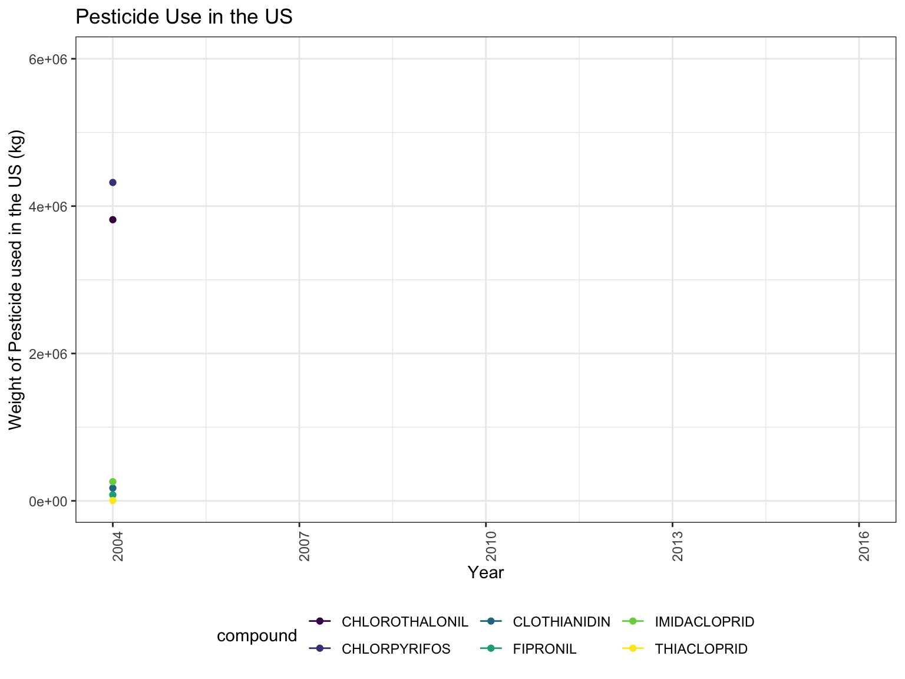

<br>

The goal of this first analysis was to identify time-dependent trends and regional changes in pesticide use and bee populations in the United States since the early 2000's. 

# Temporal Analysis

<center>


<br>

<left>
The graph above shows the variations in use of the six most common pesticides in the United States from 2004 to 2016. Two of these compounds, Chlorpyfiros and Chlorothalonil, appear to be used to a much greater extent than the others. These two compounds are known to be insecticides that can potentially lead to nervous fucntion loss in bees, as well as bee population loss.

<br>


```{r, echo=FALSE, message=FALSE}
library(tidyverse)
library(viridis)
library(readxl)
library(corrplot)
library(patchwork)
library(ggplot2)
library(ggmap)
library(maps)
library(choroplethrMaps)


knitr::opts_chunk$set(
	echo = TRUE,
	warning = FALSE,
	fig.width = 8, 
  fig.height = 6,
  out.width = "90%"
)
options(
  ggplot2.continuous.colour = "viridis",
  ggplot2.continuous.fill = "viridis"
)
scale_colour_discrete = scale_colour_viridis_d
scale_fill_discrete = scale_fill_viridis_d
theme_set(theme_bw() + theme(legend.position = "bottom"))
knitr::opts_chunk$set(echo = TRUE)
```

<br>

```{r, echo=FALSE, message=FALSE, include=FALSE}
corr_state = read_csv("./data/top_pesticides.csv") %>% 
  group_by(compound, state_fips) %>%
  summarise(mean_pest_high = mean(epest_high_kg, na.rm = TRUE)) %>% 
  pivot_wider(
    names_from = "compound",
    values_from = "mean_pest_high",
  ) %>% 
  select(-state_fips)

corr_state %>%
  view()

matrix_state_1 = cor(corr_state, use = "everything", method = c("pearson"))
matrix_state_1

matrix_state_2 = cor(corr_state, use = "complete.obs", method = c("pearson"))
matrix_state_2

#visualization 

corrplot(matrix_state_2, order = "hclust", type = "full")

```


<br>

<center>


 

<left>
Similarly, the graphs above illustrate changes in bee population over time, for honey bees and all bees  respectively. Both honey bee and all bee populations decreased or plateaued in 2007-2008. 

<br>

# Spatial Analysis


<br>

<left>
To supplement our time-dependent analysis, we aimed to understand how pesticide use and bee colonies varied across states during the same timeframe. 

 
**Figure 4: Honey Producing Colonies across the US**

```{r, echo=FALSE, message=FALSE}

library(choroplethrMaps)
data(state.map)

state.map = 
  state.map %>%
  filter(region != "alaska", region != "hawaii")

merged_state_data = read_csv("./data/merged_state_data.csv")

merged_state_data_map =
  merged_state_data %>%
  mutate(state = str_to_lower(state)) %>%
  rename(region = state)

state_map_data = left_join(state.map, merged_state_data_map, by = "region")

honey_bee_colony_map = 
  ggplot(state_map_data, aes(long, lat, group = group, fill = honey_producing_colonies)) + 
  geom_polygon(color = "black") + 
  theme_void() + 
  labs(title = "Honey Producing Colonies") + 
  coord_map(projection = "bonne", lat0 = 50) + 
  theme(plot.title = element_text(hjust = 0.5)) 
  

honey_bee_colony_map
```


<br>

**Figure 5: Pesticide Use across the US**

```{r, echo=FALSE, message=FALSE}

library(choroplethrMaps)
data(state.map)

state.map = 
  state.map %>%
  filter(region != "alaska", region != "hawaii")


merged_state_data = read_csv("./data/merged_state_data.csv")

state_all_pest =
  merged_state_data %>%
  mutate(state = str_to_lower(state)) %>%
  rename(region = state)

state_all_pest_map = left_join(state.map, state_all_pest, by = "region")

all_pest_map =
  ggplot(state_all_pest_map, aes(long, lat, group = group, fill = high)) + geom_polygon(color = "black") + theme_void() + labs(title = "Cumulative Pesticide Use", fill = "Estimated Pesticide Use (Kg)") +  coord_map(projection = "bonne", lat0 = 50) + theme(plot.title = element_text(hjust = 0.5)) + scale_fill_gradient(low = "white", high = "red") 

all_pest_map
```

<br>

<left>
The maps above show that a few states stand out in terms of having a lower honey bee colony count (ie, California, North Dakota, South Dakota, Florida) and/or a higher level of pesticide use (ie, Georgia, Florida, Texas, California) relative to other states. 

<br>

# Correlation

<br>

<left>
In addition to the temporal and regional analyses, we also assessed correlation between the pesticides to avoid any collinarity issues. 

**Table 1: Pearson Correlation Coefficients for mean persticide use across states**

```{r,echo=FALSE, message=FALSE}

matrix_state_2 = cor(corr_state, use = "complete.obs", method = c("pearson"))

knitr::kable(matrix_state_2)
```

This table indicates that Chlorothalonil and Chlorpyrifos are highly correlated. Further, Imidacloprid is highly correlated with these two compounds.  

<br>

<left>
These exploratory results led us to question whether bee population loss could be related to increased pesticide use in general and as well as specifically in 2007-2008. We decided to look more closely at the two major pesticides (Chlorpyfiros and Chlorothalonil) and at states that stood out such as California, Florida, New Mexico, and North and South Dakota. 