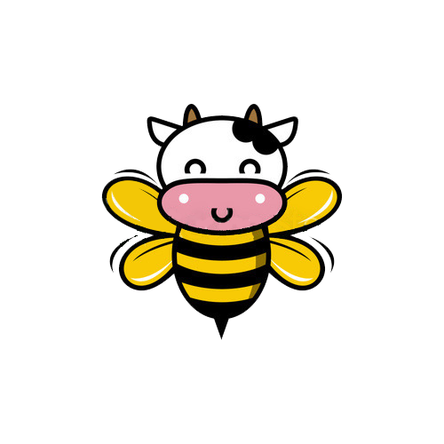

   

# Pesticide Use and Bee Population in the United States 
### Mapping and exploring pesticide use and the effect it has on bee population in the U.S.

[Tessa Bloomquist](https://github.com/tessbloomquist), [Misbath Daouda](https://github.com/misbath), [Lizbeth Gomez](https://github.com/LizbethGomez), [Sarah McLarnan](https://github.com/smm2316) and [Maya Spaur](https://github.com/mayaspaur)
 
 

