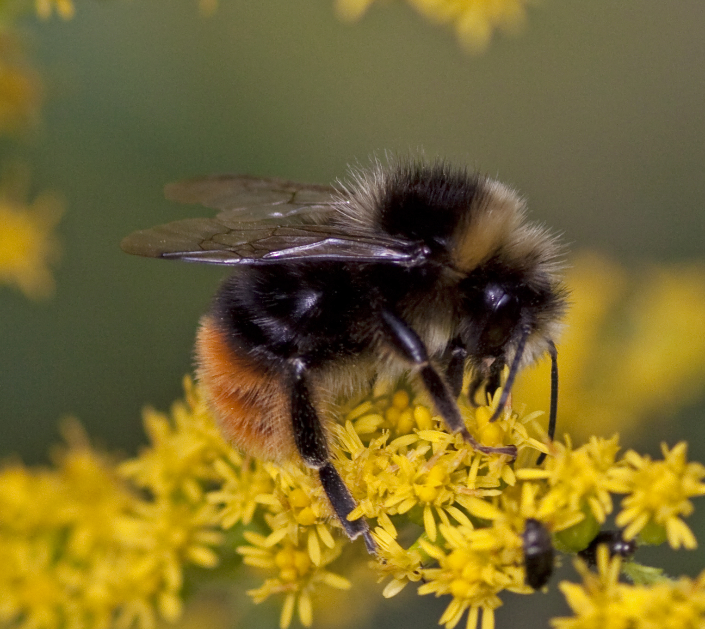

 

# **Background**

Exposure to insecticides can make bees more susceptible to pathogens as pesticides suppress their immune systems; studies suggest that this pesticide-pathogen interaction may be driving bees’ widespread collapse in the U.S. over recent decades (Sánchez-Bayo et al. 2016).

Nosema ceranae, a gut microsporidian that can infect bees and has contributed to widespread bee decline, was first found in the U.S. around the same time that neonicotinoids were introduced (Sánchez-Bayo et al. 2016). When bees infected with Nosema are exposed to imidacloprid, a neonicotinoid, they cannot sterilize the colony so the pathogen spreads within the colony (Sánchez-Bayo et al. 2016). Additionally, bees infected with N. ceranae that are exposed to another neonicotinoid, thiacloprid, or the phenyl-pyrazole, fripronil, have higher mortality than non-exposed bees (Sánchez-Bayo et al. 2016). Fipronil and imidacloprid suppress immunity-related genes in honey bees, leading to higher mortality rates for hives infected with Nosema (Sánchez-Bayo et al. 2016). There is a known mechanism of action for immune suppression for neonicotinoids, specifically clothianidin and imidacloprid (Di Prisco et al., 2013).

A survey of pesticides applied to agricultural areas in southern U.S. row crops reported neonicotinoid seed treatments using clothianidin, imidacloprid, and thiacloprid in the high agriculture survey area, in 2014 and 2015 growing seasons (Zawislak et al. 2019). The distribution of foliar applied pesticides in the high-agriculture survey area included chlorpyrifos and clothianidin, among others. Pesticide residues detected in hive products include chlorothalonil and chlorpyrifos (Zawislak et al. 2019). A migratory beekeeper study from Florida to Maine was collected after the colony collapse disorder erupted in 2007, with colonies sampled after each stop along the route (Frazier et al. 2011). The study found the fungicide chlorothalonil and the insecticides chlorpyrifos and imidacloprid in bee-collected pollen (Frazier et al. 2011).

 

# **Initial Questions**

Here we examine county level data on pesticide use and county level data on bee colonies to see if there are any trends between certain chemical compounds and bee colony decline. We include information on the relationship between bee population over time as well as pesticide use over time controlling for seasonality. Additionally, we  examine bee population in the counties with the highest and lowest pesticide use. Based on these trends, we investigated pesticides that have stronger associations with bee colony population over time. We aim to identify pesticides that are associated with changes in bee populations, specifically those that might contribute to the recent decline in bee populations nationally.

Initially we wanted to look at all the pesticides used accross the US, but the number of compunds exceded the thousands; thus we decided to narrow this number to the most commonly used. 

In this report we present:  

* Bee population variability from 2002 - 2012  by state and county  
* Pesticide use accross from 2002 - 2016 by state and county  
* Correlations for bee population and pesticide use over time within states and counties  

 

# **Data sources and availability**

* Pesticide use data was obtained from the [USGS](https://water.usgs.gov/nawqa/pnsp/usage/maps/county-level/)

* County-level and State-level bee colony data obtained from the [USDA](https://data.world/finley/bee-colony-statistical-data-from-1987-2017) 

  * County-level dataset can be accessed [here](https://query.data.world/s/266nsnl3bnmozsl2xld7komsiyzp22). Cleaning involved using `select` and `mutate` from the `Tidyverse` package. Additionally, this dataset is very messy, with many missing values, thus we worked on managing these without loosing important information. Lastly, this dataset was intended to be merged by state using `state_county_fips` variables which had to be transformed into the right type and length. 
  

Based on the literature, the following pesticides were selected for analysis in this project:    

* Neonicotinoids:
Imidacloprid, Thiacloprid, Clothianidin   
* Organophosphate:
Chlorpyrifos  
* Fungicide:
Chlorothalonil  
* Other insecticide:
Fipronil  

 

# **Methods**

*County-level Bee*
 

The dataset can be accessed [here](https://query.data.world/s/266nsnl3bnmozsl2xld7komsiyzp22). Cleaning involved using `select` and `mutate` from the `Tidyverse` package. Additionally, this dataset is very messy, with many missing values, thus we worked on managing these without loosing important information. Lastly, this dataset was intended to be merged by state using `state_county_fips` variables which had to be transformed into the right type and length. 

*State-level Bee*
 

The state-level honey bee dataset can be accessed [here](https://usda.library.cornell.edu/concern/publications/rn301137d?locale=en). Honey bee population data was reported in multiple csv files, 1 file for each year. The individual csv files were merged with a function. Two read_csv commands were incorporated into the function to read each data file but also to remove the first rows of the dataset that contained unnecessary headers. After unseating the data, column headers were renamed with `rename`, `separate`, and `select` to better describe the variables. All three of these functions are apart of the `Tidyverse`. State names within the datasets were also written as abbreviations before the year 2011, so states were recoded to represent the full state name. This dataset was exported as a csv for use in additional analyses throughout the working environment. This dataset was also merged with the `state_county_fips` dataset after some manipulation to the correct layout. 

*Pesticide Data*
  

Pesticide data was obtained from [USGS](https://water.usgs.gov/nawqa/pnsp/usage/maps/county-level/) and was available at the county level. A function was used to read in data from each year from 2004 to 2016, which were located in separate csv files.  Data was filtered for the pesticides of interest so that the merged data file only contained data for those 6 pesticides. The pesticides data was merged to the county and state level bee colony files using the methods described below.

*Merging Datasets*
 

In order to merge the data on pesticide use and bee data sets we required a vector common to both data sets but unique to each geographic area and year of data. To create this field we merged the bee data by state/county with a file of FIPS codes. We then merged the unique FIPS for each county with the year to generate a unique number identifying data from each county/state in each year (e.g. 200201001 uniquely identifies the 2002 data from Atauga County, Alabama). This value was then used to merge the pesticide data to both the county and state level bee data. 

Maps of state level bee populations and pesticide production were generated through use of the`choroplethrMaps` package and ggplot. The `states.map` dataframe in the `choroplethrMaps` package provided the underlying map which the state level data was merged with using state name. All maps were modified to the void theme with a bonne projection for asthetic purposes. 

Maps of county level pesticide use and bee colony counts were created using the merged files of pesticide use data and county colony count (for all bee populations) data. The base county map was built using the 'county' map provided by the `maps` package, for the conterminious United States. The `ggplot2` package was used to map county level pesticide use data and county level bee colony county data on top of the base county map.

