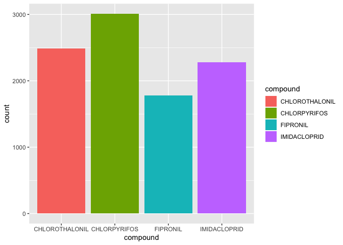

Pesticides\_Data
================
Maya Spaur
11/14/2019

This document is to: 1-Check to see if our pesticides of interest are in the dataset. 2-Filter each dataset to the pesticides of interest. 3-Merge all the years together.

FINDINGS:
=========

All 6 pesticides, "CHLOROTHALONIL","CHLORPYRIFOS" "CLOTHIANIDIN", "FIPRONIL","IMIDACLOPRID",and "THIACLOPRID" have data from 2004-2016. Only 4 pesticides, "CHLOROTHALONIL","CHLORPYRIFOS", "FIPRONIL","IMIDACLOPRID" had data from 2002-2003.

``` r
library(tidyverse)
```

    ## ── Attaching packages ────────────────────────────────────────────────────────────────────── tidyverse 1.2.1 ──

    ## ✔ ggplot2 3.2.0     ✔ purrr   0.3.2
    ## ✔ tibble  2.1.3     ✔ dplyr   0.8.3
    ## ✔ tidyr   1.0.0     ✔ stringr 1.4.0
    ## ✔ readr   1.3.1     ✔ forcats 0.4.0

    ## ── Conflicts ───────────────────────────────────────────────────────────────────────── tidyverse_conflicts() ──
    ## ✖ dplyr::filter() masks stats::filter()
    ## ✖ dplyr::lag()    masks stats::lag()

``` r
library(viridis)
```

    ## Loading required package: viridisLite

``` r
library(readxl)
library(ggplot2)
```

``` r
file_path = "./data/pesticides_csv/"
file_names = file_path %>% 
  list.files()

top_pesticides_df = 
  file_names %>%
  map_dfr(function(file_name){
  read_excel(paste0(file_path, file_name))
}) 

top_pesticides = top_pesticides_df %>% 
  janitor::clean_names() %>%
  filter(compound %in% c("CHLOROTHALONIL", "CLOTHIANIDIN", "CHLORPYRIFOS","FIPRONIL", "IMIDACLOPRID",      "THIACLOPRID"),
         year >= 2004) %>% 
  mutate(
    state_fips = state_fips_code,
    county_fips = county_fips_code,
    state_county_fips = paste0(state_fips, county_fips),
    epest_low_kg = round(epest_low_kg),
    epest_high_kg = round(epest_high_kg)) %>%
  select(-state_fips_code, -county_fips_code) 

write.csv(top_pesticides, "./data/top_pesticides.csv")

view(top_pesticides)
```

Counting the data - sample for 2002

``` r
pest_2002 = read_excel("./data/pesticides_csv/EPest.county.estimates.2003.xlsx") %>%
  janitor::clean_names() %>% 
  filter(compound == "CHLOROTHALONIL" | compound == "CLOTHIANIDIN"| compound == "CHLORPYRIFOS" | compound == "FIPRONIL" | compound == "IMIDACLOPRID"| compound ==  "THIACLOPRID") %>%
  group_by(compound) %>%
  summarize(n = n()) %>%
  select(compound, n)

pest_2002
```

    ## # A tibble: 4 x 2
    ##   compound           n
    ##   <chr>          <int>
    ## 1 CHLOROTHALONIL  2491
    ## 2 CHLORPYRIFOS    3011
    ## 3 FIPRONIL        1780
    ## 4 IMIDACLOPRID    2281

Vizualing the data - sample plot for 2003

``` r
pest_2003 = read_excel("./data/pesticides_csv/EPest.county.estimates.2003.xlsx") %>%
  janitor::clean_names() %>% 
  filter(compound == "CHLOROTHALONIL" | compound == "CLOTHIANIDIN"| compound == "CHLORPYRIFOS" | compound == "FIPRONIL" | compound == "IMIDACLOPRID"| compound ==  "THIACLOPRID") %>%
  ggplot(aes(x = compound, fill = compound)) + geom_bar()


pest_2003
```



Counting the data for 2015

``` r
pest_2015 = read_excel("./data/pesticides_csv/EPest.county.estimates.2015.xlsx") %>%
  janitor::clean_names() %>% 
  filter(compound == "CHLOROTHALONIL" | compound == "CLOTHIANIDIN"| compound == "CHLORPYRIFOS" | compound == "FIPRONIL" | compound == "IMIDACLOPRID"| compound ==  "THIACLOPRID")  %>%
  group_by(compound) %>%
  summarize(n = n()) %>%
  select(compound, n)

pest_2015
```

    ## # A tibble: 6 x 2
    ##   compound           n
    ##   <chr>          <int>
    ## 1 CHLOROTHALONIL  2655
    ## 2 CHLORPYRIFOS    2987
    ## 3 CLOTHIANIDIN    1001
    ## 4 FIPRONIL         347
    ## 5 IMIDACLOPRID    2923
    ## 6 THIACLOPRID      464
