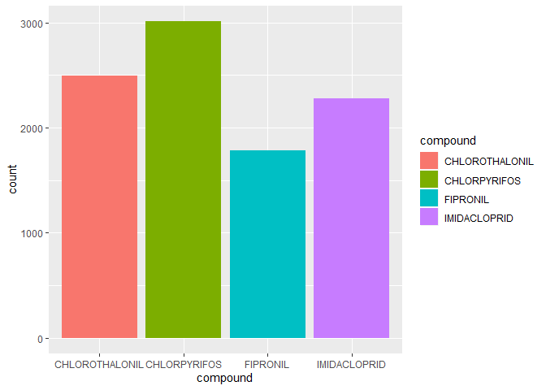

Pesticides\_Data
================
Maya Spaur
11/14/2019

This document is to check to see if our pesticides of interest are in
the dataset.

\#FINDINGS: All 6 pesticides, “CHLOROTHALONIL”,“CHLORPYRIFOS”
“CLOTHIANIDIN”, “FIPRONIL”,“IMIDACLOPRID”,and “THIACLOPRID” have data
from 2004-2016. Only 4 pesticides, “CHLOROTHALONIL”,“CHLORPYRIFOS”,
“FIPRONIL”,“IMIDACLOPRID” had data from 2002-2003.

``` r
library(tidyverse)
```

    ## -- Attaching packages --------------------------------------- tidyverse 1.2.1 --

    ## v ggplot2 3.2.1     v purrr   0.3.3
    ## v tibble  2.1.3     v dplyr   0.8.3
    ## v tidyr   1.0.0     v stringr 1.4.0
    ## v readr   1.3.1     v forcats 0.4.0

    ## -- Conflicts ------------------------------------------ tidyverse_conflicts() --
    ## x dplyr::filter() masks stats::filter()
    ## x dplyr::lag()    masks stats::lag()

``` r
library(viridis)
```

    ## Loading required package: viridisLite

``` r
library(readxl)
library(ggplot2)
```

copied from data\_processing document:

``` r
pest_2002 = read_excel("./data/pesticides_csv/EPest.county.estimates.2002.xlsx") %>% 
  janitor::clean_names() %>% 
  mutate(
    state_fips = state_fips_code,
    county_fips = county_fips_code,
    state_county_fips = paste0(state_fips, county_fips),
    epest_low_kg = round(epest_low_kg),
    epest_high_kg = round(epest_high_kg)) %>%
  select(-state_fips_code, -county_fips_code)
```

Counting the data - sample for 2002

``` r
pest_2002 = read_excel("./data/pesticides_csv/EPest.county.estimates.2003.xlsx") %>%
  janitor::clean_names() %>% 
  filter(compound == "CHLOROTHALONIL" | compound == "CLOTHIANIDIN"| compound == "CHLORPYRIFOS" | compound == "FIPRONIL" | compound == "IMIDACLOPRID"| compound ==  "THIACLOPRID") %>%
  group_by(compound) %>%
  summarize(n = n()) %>%
  select(compound, n)

pest_2002
```

    ## # A tibble: 4 x 2
    ##   compound           n
    ##   <chr>          <int>
    ## 1 CHLOROTHALONIL  2491
    ## 2 CHLORPYRIFOS    3011
    ## 3 FIPRONIL        1780
    ## 4 IMIDACLOPRID    2281

Vizualing the data - sample plot for 2003

``` r
pest_2003 = read_excel("./data/pesticides_csv/EPest.county.estimates.2003.xlsx") %>%
  janitor::clean_names() %>% 
  filter(compound == "CHLOROTHALONIL" | compound == "CLOTHIANIDIN"| compound == "CHLORPYRIFOS" | compound == "FIPRONIL" | compound == "IMIDACLOPRID"| compound ==  "THIACLOPRID") %>%
  ggplot(aes(x = compound, fill = compound)) + geom_bar()


pest_2003
```

<!-- -->

Counting the data for 2015

``` r
pest_2015 = read_excel("./data/pesticides_csv/EPest.county.estimates.2015.xlsx") %>%
  janitor::clean_names() %>% 
  filter(compound == "CHLOROTHALONIL" | compound == "CLOTHIANIDIN"| compound == "CHLORPYRIFOS" | compound == "FIPRONIL" | compound == "IMIDACLOPRID"| compound ==  "THIACLOPRID")  %>%
  group_by(compound) %>%
  summarize(n = n()) %>%
  select(compound, n)

pest_2015
```

    ## # A tibble: 6 x 2
    ##   compound           n
    ##   <chr>          <int>
    ## 1 CHLOROTHALONIL  2655
    ## 2 CHLORPYRIFOS    2987
    ## 3 CLOTHIANIDIN    1001
    ## 4 FIPRONIL         347
    ## 5 IMIDACLOPRID    2923
    ## 6 THIACLOPRID      464

Bind rows \#needs to be done
