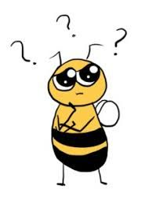

 

The main goal of our analysis was to investigate the potential relationship between pesticide use and bee populations. We found that there is a small, but measurable, effect from pesticides on the bee population. The [Additional Analysis](https://misbath.github.io/bee_project.github.io/add_analysis.html) shows this correlation is quite variable across states, evident by the Pearson correlation coefficient plot. Based on previous research, we hypothesized that the correlation between pesticides and bee population would be negative- the more pesticides in use, the smaller the bee population. For some states, this correlation is moderate while for other states, it is non-existant or even positive, the opposite of what we expected. 

 

The analyses performed for this project might not have been localized enough to see these trends. Unfortunately, there was a lot of missing data on the county level and variability in which compounds were reported. Ideally, as the importance of tracking pesticides and bee populations increases, a standardized method of data collection will produce more reliable results that will be more informative in years to come. 

 

We examined the pesticide and bee data with a number of different analyses before investigating correlations. Interestingly, as seen in figures 1 and 2, the increase in pesticide corresponds almost perfectly to the drop in honey bee and bee populations plotted. 

 
Additionally, we wanted to visually represent the use of pesticides and colonies spatially by state. Figures 4 and 5 show number of colonies and cumulative pesticide use by state. As seen in these maps, California has a high number of honey producing colonies and a moderate use of cumulative pesticides. However, states like Georgia, which use quite a large amount of pesticides has a small number of honey producing colonies. States in the central United States do not show a clear relationship between the exposure and outcome. We presume other environmental factors, such as climate are at play here. Another factor that may have contributed to this trend is the high proprtion of missing data on pesticide use. Visual map assessment of pesticide use data at the county level reveal the widespread lack of available data on even the top two pesticides across the conterminous U.S.

 

This relationship between pesticides themselves can be exampined with the Pearson correlation coefficient plot within our [Exploratory Analyses](https://misbath.github.io/bee_project.github.io/exploring.html). This correlation yielded information on pesticide use and bee population change over time. Table 1 shows the correlation coefficients. Specifically we oberved a highly positive correlation between Chlorpyfiros, Imidacloprid and Chlorothalonil use. We found that compunds Chlorpyrifos and Chlorothalonil specifically are used in much higher quantities across all years. These two compunds have formualations and solvents that are known to be highly orally toxic to bee larvae [Zhu et. al](https://journals.plos.org/plosone/article?id=10.1371/journal.pone.0077547).

 

Future analysis could examine the effects of weather on bee population. This could range from looking at changes in temperature over time to the effect of precipitation. Linear models adjusting for all of these variables could be built as well as non-linear models such as segmented regression or generalized additive models to best test a threshold for bee colony decline.

While this analysis does not demonstrate a very strong effect of pesticides on bee population, please consider taking the following precautions to conserve the bee ecosystem!

* Plant a pollinator garden
* Avoid pesticide use in the yard
* Conserve bee nesting habitats
* Educate others!

 

 

<left>

# **References**

Frazier, J., Mullin, C., Frazier, M., & Ashcraft, S. (2011). Pesticides and their involvement in colony collapse disorder. Am Bee J, 151, 779-781. https://bee-health.extension.org/pesticides-and-their-involvement-in-colony-collapse-disorder/

Sánchez-Bayo, F., Goulson, D., Pennacchio, F., Nazzi, F., Goka, K., & Desneux, N. (2016). Are bee diseases linked to pesticides?—A brief review. Environment international, 89, 7-11.https://www-sciencedirect-com.ezproxy.cul.columbia.edu/science/article/pii/S0160412016300095?via%3Dihub

G. Di Prisco, V. Cavaliere, D. Annoscia, P. Varricchio, E. Caprio, F. Nazzi, G. Gargiulo, F. Pennacchio
Neonicotinoid clothianidin adversely affects insect immunity and promotes replication of a viral pathogen in honey bees, PNAS, 110 (2013), pp. 18466-18471

van Lexmond, M.B., Bonmatin, JM., Goulson, D. et al. Environ Sci Pollut Res (2015) 22: 1. https://doi.org/10.1007/s11356-014-3220-1

Zawislak, J., Adamczyk, J., Johnson, D. R., Lorenz, G., Black, J., Hornsby, Q., ... & Joshi, N. (2019). Comprehensive Survey of Area-Wide Agricultural Pesticide Use in Southern United States Row Crops and Potential Impact on Honey Bee Colonies. Insects, 10(9), 280. https://www.mdpi.com/2075-4450/10/9/280/htm

Zhu W, Schmehl DR, Mullin CA, Frazier JL. Four Common Pesticides, Their Mixtures and a Formulation Solvent in the Hive Environment Have High Oral Toxicity to Honey Bee Larvae. PLOS ONE. 2014;9(1):e77547. doi:10.1371/journal.pone.0077547

Image: https://commons.wikimedia.org/wiki/File:Bumble_Bee_(4849358448).jpg  

